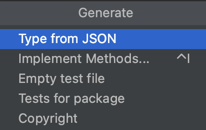
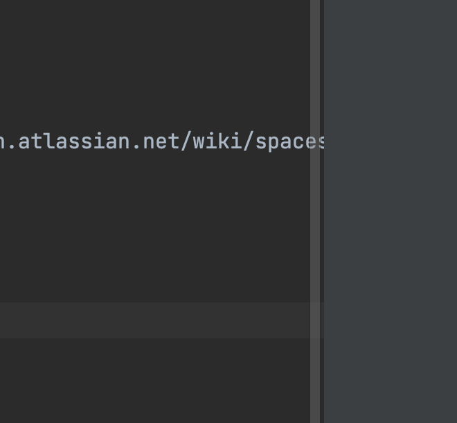
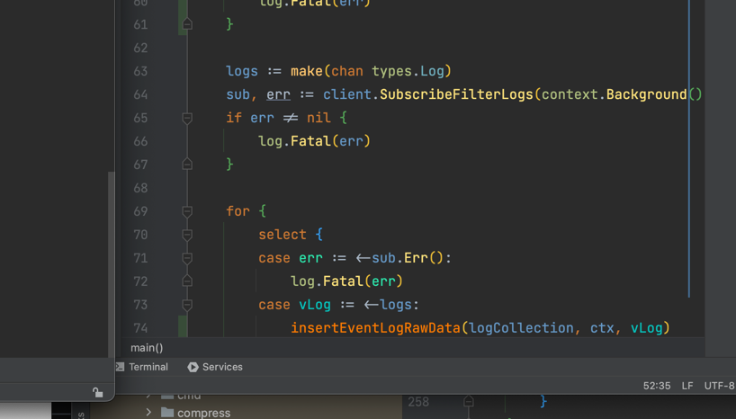

1

# ERC20 History

121

json to go

command + N



<!-- TOC -->

* [sidebar_position: 2](#sidebar_position--2)
* [ERC20 History](#erc20-history)
  * [URL](#url)

<!-- TOC -->

https://hanwha-blockchain.atlassian.net/wiki/spaces/ABT/pages/966459490/golang+Tx+History+-

asdfsadf

ㄴㅇㄹㅁㄴㅇㄹ \ㅁ\

dasfsadf

# 오 괜찮은데

ㅁㄴㅇㄹ

```plantuml
span
```



ㅁㄴㄹURL

- []
- (


| col1 | col2 | col3 |
| ------------------------------------------- | ---- | ---- |
|                                             |      |      |
|                                             |      |      |

* [ ]  1212
* [ ]

asdf

!

[image.png](assets/image2.png)

🎉️

```plantuml
wse

```

# 1

## 1.1

asdfsadf

asdf

### 1.1.1

asdfsad

asdf

sadf

### 1.1.2

sdfasd

asdf

## 1.2

* 1212
*

asdfsd

asdf

# 2

* [X]  12
* [ ]  12
* [ ]  121313
  * sdf

* [X] 😂😑😛
